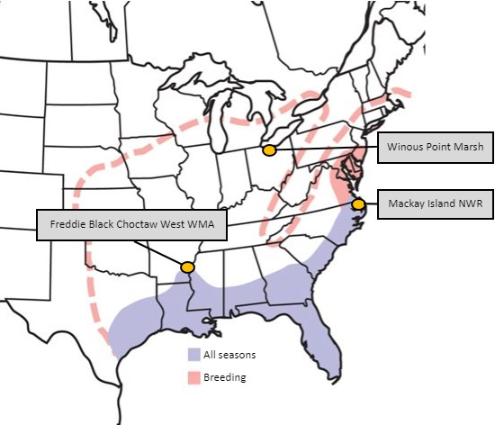

### Aim:  
We are using [ANGSD](http://www.popgen.dk/angsd/index.php/ANGSD#Overview) to better understand gene flow between three geographically distinct populations of king rail (_Rallus elegans_). One individual from each population will be compared using [ABBABABA(D-stat)](http://www.popgen.dk/angsd/index.php/Abbababa). Our presentation of our steps and findings is located in the PresentationSlides subdirectory. 

---
### Contents
- **KingRailBreedingRangeMap.jpg**: A JPG file with sample locations.
- **ABBA-BABA-test.md**: Markdown file with the steps involved in the ABBA-BABA test.

---
### King Rail Sample Populations
  
  
[*Range map created by the Audubon Society*](https://www.audubon.org/field-guide/bird/king-rail)     

---    
### Collaborators 
Our collaborators who graciously provided samples are listed below:
- [Jessica Schmit, U.Ark.](https://www1.usgs.gov/coopunits/staff/2354999)
- [Dr. Dustin Brewer, U. Central Michigan](https://www.researchgate.net/profile/Dustin-Brewer-2)
- [Dr. Elisa Elizondo, U.Del.](https://www.researchgate.net/profile/Elisa-Elizondo)
- [Dr. Andrew Kratter, FL Museum of Natural Sciences](https://www.researchgate.net/profile/Andrew-Kratter)

---
### Funding Sources
Grant funding for this project was generously awarded by The Garden Club of America, The Carolina Bird Club, and The Association of Field Ornithologists.
